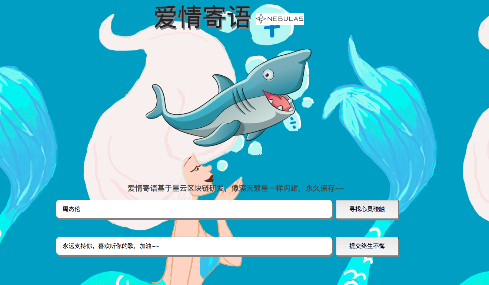
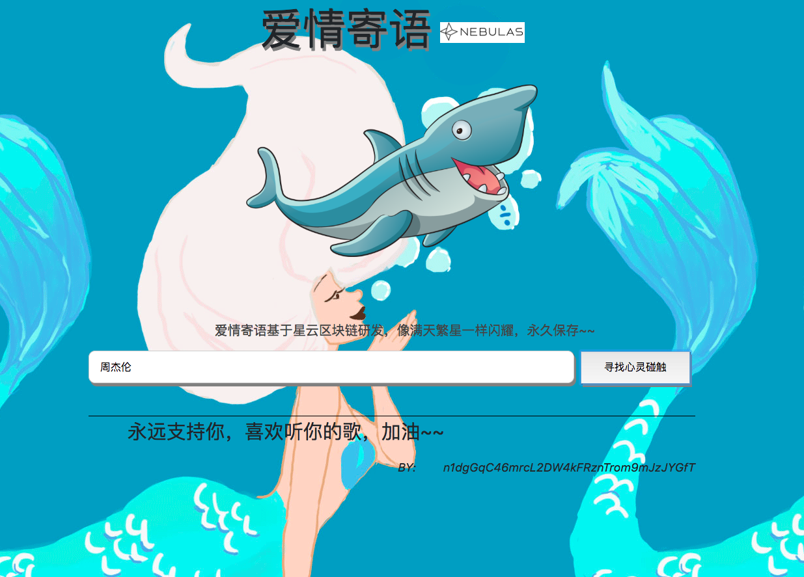
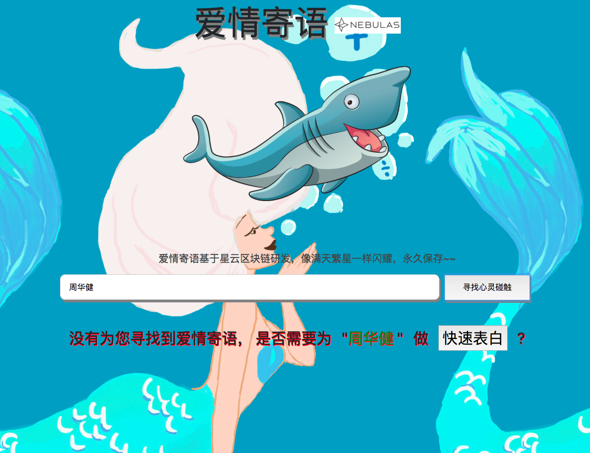

# LoveMessage
### 基于星云区块链研发去中心化Dapp,可以永久保存爱情寄语，永不丢失。。

## 使用方法： 电脑谷歌浏览器访问网址：http://yrx0511.gz01.bdysite.com/NAS/LoveMessage/index.html

## 录入爱情寄语到区块链页面

## 查询区块链上爱情寄语页面

## 区块链上没有查询结果页面

## 运行条件
* 用谷歌浏览器打开 index.html 网页
* 谷歌浏览器安装星云钱包插件，插件地址： https://github.com/ChengOrangeJu/WebExtensionWallet

点击顶部星云logo 可以跳转到星云官网，实时了解官方动态。

## License

    Copyright 2015 tyrantgit

    Licensed under the Apache License, Version 2.0 (the "License");
    you may not use this file except in compliance with the License.
    You may obtain a copy of the License at

       http://www.apache.org/licenses/LICENSE-2.0

    Unless required by applicable law or agreed to in writing, software
    distributed under the License is distributed on an "AS IS" BASIS,
    WITHOUT WARRANTIES OR CONDITIONS OF ANY KIND, either express or implied.
    See the License for the specific language governing permissions and
    limitations under the License.
